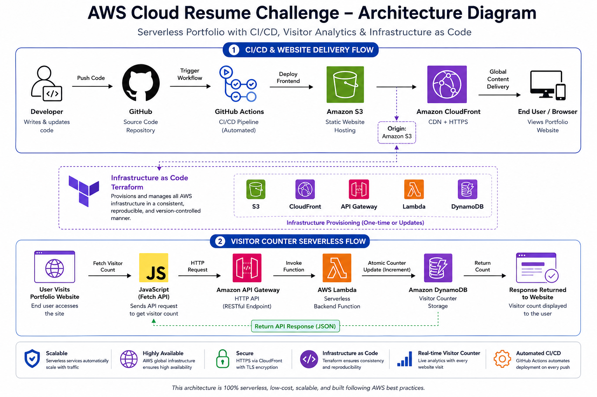

# AWS Cloud Resume Challenge

> Serverless portfolio project built using AWS, Terraform, and CI/CD automation.

---

## Project Overview

This project is a cloud-hosted portfolio application built on AWS using serverless services, Infrastructure as Code (Terraform), and automated deployment pipelines. It demonstrates core cloud engineering practices: infrastructure versioning, CI/CD automation, and scalable backend systems.

**Key Components:**
- Fully serverless architecture with zero EC2 instances
- 100% Infrastructure as Code using Terraform
- Automated CI/CD deployment pipeline
- Dynamic visitor counter using DynamoDB
- Global content delivery via CloudFront CDN
- HTTP API powered by API Gateway and Lambda

---

## Architecture



**Architecture Overview:**
1. **CI/CD & Website Delivery Flow** — Developer pushes code → GitHub Actions triggers → Frontend deployed to S3 → CloudFront invalidates cache → Global delivery to end users
2. **Visitor Counter Serverless Flow** — User visits site → JavaScript fetches visitor count → API Gateway routes request → Lambda function executes → DynamoDB increments counter → JSON response returned to frontend

---

## AWS Services

| Service | Purpose | Justification |
|---------|---------|---------------|
| **S3** | Static website hosting | Cost-effective, highly available storage for HTML/CSS/JS |
| **CloudFront** | CDN + HTTPS | Global content delivery, automatic SSL/TLS, DDoS protection |
| **API Gateway** | HTTP API endpoint | Serverless API management, request routing, CORS handling |
| **Lambda** | Visitor counter backend | Serverless compute, pay-per-use pricing, Python runtime |
| **DynamoDB** | Visitor counter storage | Serverless database, on-demand billing, atomic updates |
| **Terraform** | Infrastructure as Code | Version-controlled, reproducible infrastructure definitions |

---

## CI/CD Pipeline

```
Developer Commit
    ↓
GitHub Actions Trigger
    ↓
Build & Validate Frontend
    ↓
Deploy to S3
    ↓
Invalidate CloudFront Cache
    ↓
Live Website Updated
```

**Pipeline Characteristics:**
- Fully automated — code push triggers deployment
- Infrastructure changes are version-controlled
- Rapid iteration and rollback capability

---

## Infrastructure as Code

All AWS resources are managed through Terraform for consistency, reproducibility, and version control.

**Key Resources:**
- `aws_s3_bucket` — Portfolio static site storage
- `aws_cloudfront_distribution` — Global CDN with HTTPS
- `aws_dynamodb_table` — Visitor counter (PAY_PER_REQUEST mode)
- `aws_lambda_function` — Counter backend logic
- `aws_apigatewayv2_api` — HTTP API endpoint
- `aws_iam_role` — Lambda execution permissions

**Deployment:**

Terraform configuration is in `infra/terraform/` and manages all AWS resources.

---

## Features

- Responsive portfolio website (HTML5, CSS3, vanilla JavaScript)
- Dynamic visitor counter with atomic DynamoDB updates
- Fully serverless backend (no EC2 instances)
- Automated deployment pipeline with GitHub Actions
- All infrastructure defined in Terraform
- Global content delivery via CloudFront CDN
- HTTP API with Lambda backend and DynamoDB storage
- Basic cloud security practices (HTTPS, IAM roles, least-privilege access)

---

## Tech Stack

**Frontend:**
- HTML5, CSS3, JavaScript (Vanilla)
- Responsive design for mobile/desktop

**Backend:**
- AWS Lambda (Python 3.14)
- API Gateway (HTTP API)
- DynamoDB (NoSQL database)

**Infrastructure & Deployment:**
- Terraform (Infrastructure as Code)
- GitHub Actions (CI/CD pipeline)

**Cloud Platform:**
- AWS Region: ap-south-2
- Services: S3, CloudFront, Lambda, API Gateway, DynamoDB, IAM

---

## Live Demo

**Portfolio Website:**  
https://dqnd6a1cg21ft.cloudfront.net

---

## Future Roadmap

- Custom domain with Route 53
- CloudWatch monitoring and alarms
- Terraform module structure for environment parity
- Enhanced observability and logging

---

## License

MIT License — See [LICENSE](LICENSE) for details

---

This project is based on the [AWS Cloud Resume Challenge](https://cloudresumechallenge.dev/) — a community challenge to build cloud infrastructure and portfolio projects.